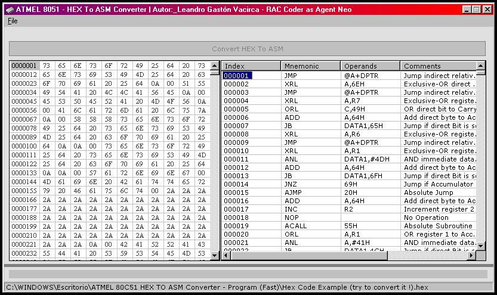

<div align="center">

## ATMEL 80C51 HEX TO ASM


</div>

### Description

The purpose of this application is to convert a 8051 hexadecimal code to a 8051 assembler code. This program can be very useful for a programmers linked to the uP programming.
 
### More Info
 
The program accepts as input a hexadecimal file.

The program converts the hexadecimal file in assembler file. The user can select the path of the output file.


<span>             |<span>
---                |---
**Submitted On**   |2004-10-25 16:52:16
**By**             |[TechBit](https://github.com/Planet-Source-Code/PSCIndex/blob/master/ByAuthor/techbit.md)
**Level**          |Intermediate
**User Rating**    |5.0 (185 globes from 37 users)
**Compatibility**  |VB 5\.0, VB 6\.0
**Category**       |[Complete Applications](https://github.com/Planet-Source-Code/PSCIndex/blob/master/ByCategory/complete-applications__1-27.md)
**World**          |[Visual Basic](https://github.com/Planet-Source-Code/PSCIndex/blob/master/ByWorld/visual-basic.md)
**Archive File**   |[ATMEL\_80C518100710252004\.zip](https://github.com/Planet-Source-Code/techbit-atmel-80c51-hex-to-asm__1-56922/archive/master.zip)

### API Declarations

```
Public Declare Function SHBrowseForFolder Lib "shell32.dll" (bBrowse As BrowseInfo) As Long
Public Declare Function SHGetPathFromIDList Lib "shell32.dll" (ByVal lItem As Long, ByVal sDir As String) As Long
Public Declare Sub Sleep Lib "kernel32" (ByVal dwMilliseconds As Long)
```


